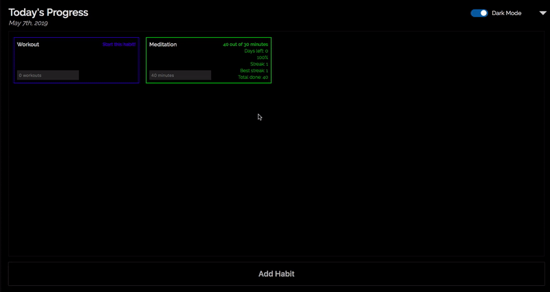
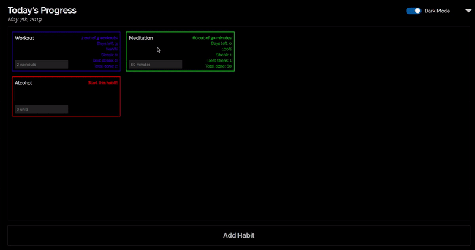
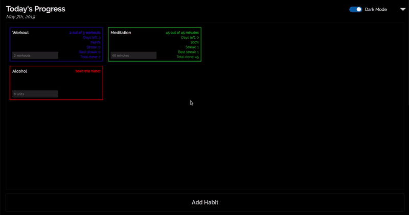
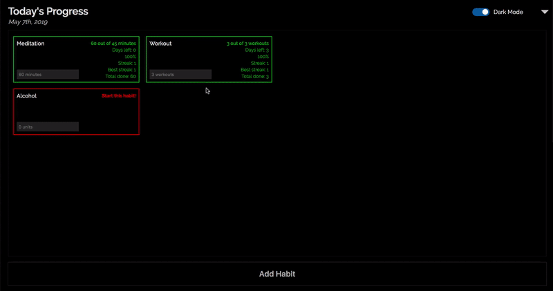

# Stay Habby

A habit tracker app, originally started by [Arie Milner](https://github.com/amilner42/habby) and currently only further developed by me.

---

## Features

### Light Mode / Dark Mode / Add a Habit

This is where you start your journey!


### Habits Automatically Sorted

Your habits will be automatically sorted by urgency, completion, and progress in the current time fragment. This should hopefully help give you an idea of which habits you should prioritize, but it is by no means a dictation.



### Edit a Habit's Goal

Sometimes your goals change. You can update a habit's goal, and don't worry, your previous goals will still be taken into account when calculating your overall success percentage.



### Suspend and Resume Habits

Sometimes your priorities change. You can suspend and resume habits as you wish. When a habit is suspended, your performance on it will not impact your success percentage. You can still enter data for the habit if you want to track it.


### Keyboard Shortcut for Entering Habit Data

If you're too lazy to click the habit's box... just do a keyboard search for it.



### Track your Journey with Notes

Inspired by Cal Newport's [Deep Work](http://calnewport.com/books/deep-work/).

Tracking "lead" measures (e.g. how many times this week you worked out) is more useful for long-term progress than tracking "lag" measures (e.g. how many PR's you hit in your workouts this week), because you have much more control over lead measures. This is the idea behind Habby: day-to-day actions are important and under your control.

But it's still quite useful to track lag measures, especially alongside your lead measure tracking. This can give you an idea of, for example, how many workouts it takes you to hit a personal record.

Note down a lag measure, or even just a diary entry, by adding a Note to a habit for the day.




### 


---


## Dev Stack

DB:
 - MongoDB

API:
 - Clojure
 - Lacinia

Web Client:
 - Elm

---

## Dev Instructions

You'll need a few local dependencies to get going, and aside from these the install scripts will get everything else
you need.

##### Local Dependencies
    - MongoDB (version: 3.2.9)
    - npm (3.10.3)
    - lein (2.7.1 running on java 1.8.0_101)

You don't need these exact versions, but having [major/minor version](https://semver.org/) correct will avoid possible
bugs.


##### Install Instructions

I like to run things in 2 terminals to keep the output cleaner.

Terminal 1:
```bash
cd web-client;
npm install; # Handles everything for you, including installing elm globally.

# Now to actually launch the frontend
npm start;
```

Terminal 2:
```bash
cd api;
lein deps; # Get's everything you need from project.clj.

# Now to actually launch the backend, first start the repl.
lein repl;
# Inside the repl in the user namespace run `(start)`, if you're not in the user namespace originally then run
# (ns user) to switch to the user namespace.
possbily-something-else => (ns user)
user => (start)
# If you have changed code within /habby/api since starting the repl, use `refresh` to start using the new code
# without needing to restart the repl
user => (refresh)
```

Great, you're good to develop now!

Keep in mind that the frontend will be running on `localhost:8080`.
The backend will be serving up the API on `localhost:8888/graphql`, which you can actually explore with graphiql by
visiting `localhost:8888`, a must-use feature while developing on the API.
